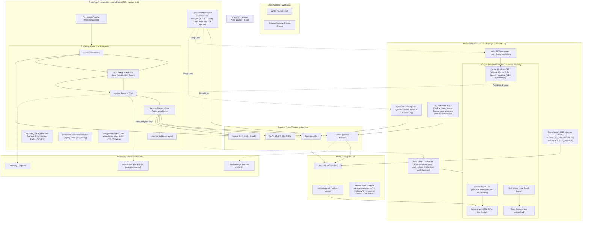

# Conduvera / ODS / AI-Stack — Kanonisches Architekturdiagramm

> EIN kanonisches Diagramm (CONDUVERA-GOAL-1.0 / close-core-adapter-seam).
> Status: 2026-08-03. Authorities siehe Authority_Map.md; UI-Konsolidierung
> siehe UI_Consolidation.md. Dieses Diagramm ist maschinenlesbar als
> `docs/architecture.mmd` gespiegelt.

## Mermaid (aktueller Ist-Stand inkl. Browser-/Access-Ebene)



## Invarianten im Diagramm (verifiziert, 2026-08-03)

| Invariante | Darstellung |
|---|---|
| Codex CLI ≠ Codex OAuth | Codex CLI (H3) → ~/.codex eigener Auth-Store (C2) → direkter Backend-Pfad (C3); Hermes/OpenCode → LiteLLM oauth/codex-* → CLIProxyAPI (geteilter Broker, M3); KEIN Ausdruck „native Codex-CLI-Route (OAuth)" |
| Buildroom/Conduvera wechseln NIE implizit GPU-Modi | O1 ist einzige Schnittstelle; kein Pfeil CORE→O1 außer via ODS-Runbook |
| `ai-stack model use` ist die einzige Moduswechsel-Schnittstelle | O1 explizit; Dashboard (UI1) hat KEINEN Modellwechsel-Pfeil |
| `workload/local` existiert nur im text-Modus | M2 mit „nur text-Modus" annotiert |
| ODS bleibt Runtime-Authority | ODS-Subgraph umschließt llama-server/CLIProxyAPI/Capabilities |
| BWS bleibt Secrets-Authority | E3 einzige Secrets-Quelle |
| Dashboard-Auth ≠ Open-WebUI-Auth | UI1 vs. UI2 getrennt annotiert |
| Owner Card/dream-session für ODS-Hermes | UI3 annotiert |
| OpenCode als Host-Service | UI5 annotiert |
| n8n mit separatem Login | UI4 annotiert |
| Conduvera Workspace ersetzt Open WebUI NOCH NICHT | Z2 annotiert (NOT_DECIDED; keine Festbindung an Hermes oder Open WebUI) |
| Browser-UI-E2E getrennt von Backend-E2E | UI-Ebene (UI_AKT) vs. Core/Backend getrennt |
| Capability-Fluss | Core/Harness → Capability-Adapter → ComfyUI/RAG/Voice/n8n/… UND Capability → MXOS-EVIDENCE (Evidence-Fluss explizit) |

## Statuswahrheit (UI/Access, 2026-08-03)

```text
CONDUVERA_WORKSPACE_IMPLEMENTATION_BASIS = NOT_DECIDED
OPEN_WEBUI_CURRENT_ACCESS               = BLOCKED_AUTH_RECOVERY
OPEN_WEBUI_BROWSER_E2E                  = NOT_PROVEN
ODS-HERMES_HEALTHY                      = SERVICE_HEALTH (nicht Browser autorisiert)
DREAM_DASHBOARD                         = SERVICE_HEALTH + AUTHENTICATED_BROWSER (Owner)
N8N_OWNER_REGISTERED                    = AUTHENTICATED_BROWSER (Owner)
OPENCODE_UI                             = SERVICE_HEALTH (Host-Service)
BACKEND_E2E                             = bewiesen (Core→Adapter→LiteLLM→Qwen)
```
